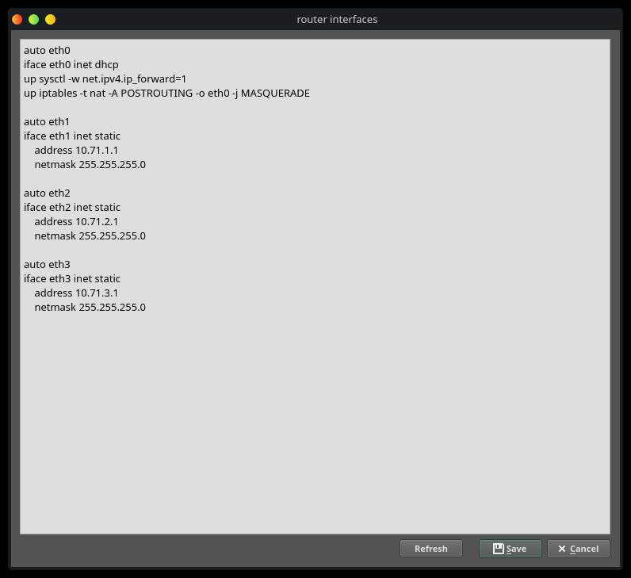
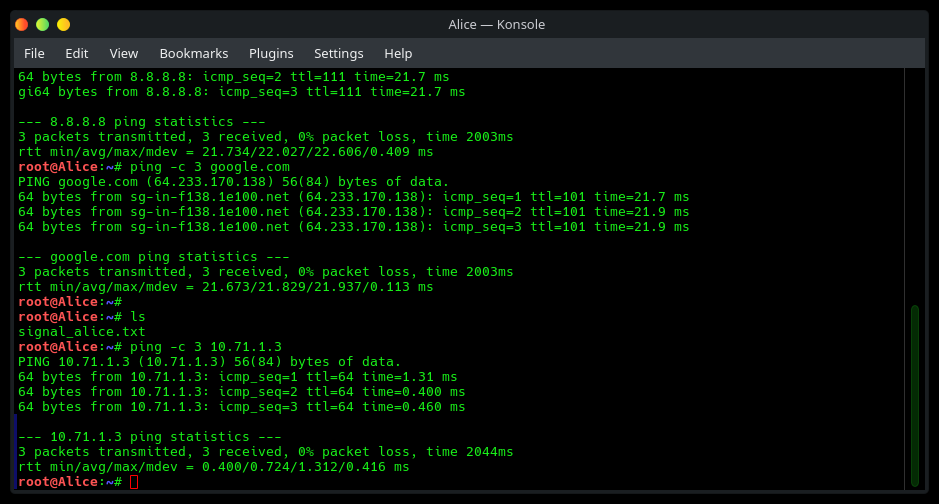
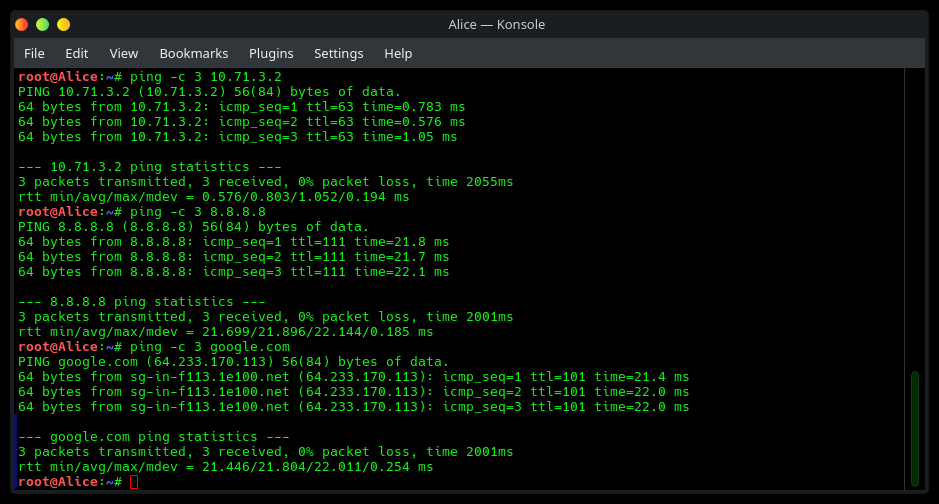
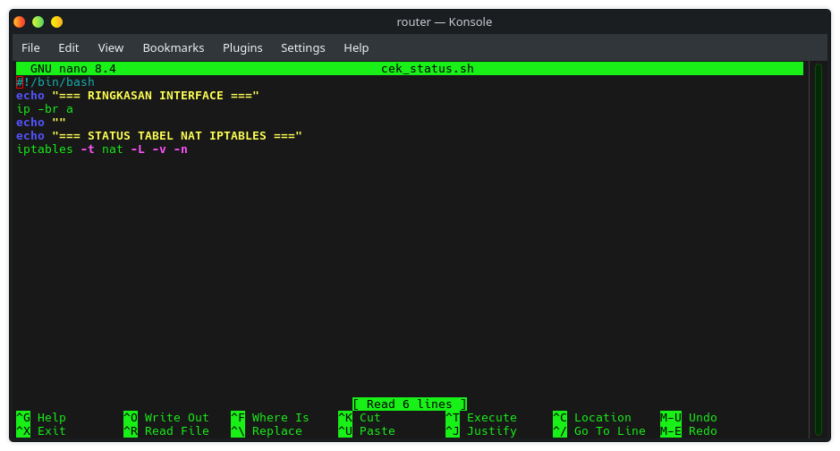
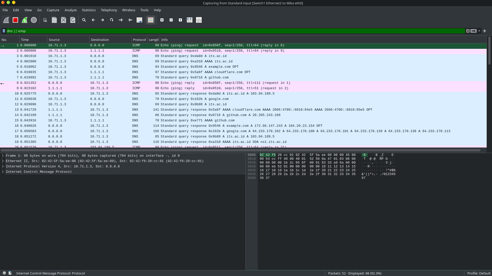

# Jarkom-Modul-1-2026-K-15

| Nama | NRP |
| ---  | --- |
| I Made Tobby Anantha Adiwijaya | 5027251064 |
| Rheza Pramudita Adi Putra | 5027251090 |

# Soal 1
    Pertama disini kita harus membuat Node yang diperlukan, disini kita memakai 1 Nat, 3 Switch, dan 5 Debinet (Client).

    

    Sambungkan Nodenya sesuai tugas yang diberikan. Kita juga harus melakukan configurasi pada client agar bisa terhubung ke jaringan.

    Client 1:
    auto eth0
    iface eth0 inet static
    address 10.71.1.2
    netmask 255.255.255.0
    gateway 10.71.1.1
    up echo "nameserver 8.8.8.8" > /etc/resolv.conf

    Client 2:
    auto eth0
    iface eth0 inet static
    address 10.71.1.3
    netmask 255.255.255.0
    gateway 10.71.1.1
    up echo "nameserver 8.8.8.8" > /etc/resolv.conf

    Client 3:
    auto eth0
    iface eth0 inet static
    address 10.71.2.2
    netmask 255.255.255.0
    gateway 10.71.2.1
    up echo "nameserver 8.8.8.8" > /etc/resolv.conf

    Client 4:
    auto eth0
    iface eth0 inet static
    address 10.71.3.2
    netmask 255.255.255.0
    gateway 10.71.3.1
    up echo "nameserver 8.8.8.8" > /etc/resolv.conf

    Client 5:
    auto eth0
    iface eth0 inet static
    address 10.71.3.3
    netmask 255.255.255.0
    gateway 10.71.3.1
    up echo "nameserver 8.8.8.8" > /etc/resolv.conf

# Soal 2
    Disini kita perlu melakukan konfigurasi agar Router bisa menggunakan internet.

    auto eth0
    iface eth0 inet dhcp
    up sysctl -w net.ipv4.ip_forward=1    
    up iptables -t nat -A POSTROUTING -o eth0 -j MASQUERADE   

    auto eth1
    iface eth1 inet static
    address 10.71.1.1
    netmask 255.255.255.0

    auto eth2
    iface eth2 inet static
    address 10.71.2.1
    netmask 255.255.255.0

    auto eth3
    iface eth3 inet static
    address 10.71.3.1
    netmask 255.255.255.0

    

# Soal 3
    Disini kita melakukan pengujian memastikan client satu sama lain terhubung.

    

    

    

    Disini kami hanya mencontohkan 3 saja.

# Soal 4
    Disini kita melakukan pengecekan apakah client bisa melakukan "ping -c 3 8.8.8.8" dan "ping -c 3 google.com".

    

# Soal 5
    Untuk mengantisipasi restart yang tiba-tiba, disini kita membuat script agar konfigurasi jaringan tidak hilang.

    

    

# Soal 6
    Disini kita melakukan penyaringan pada paket berprotokol DNS atau ICMP. Disini kita bisa mendownload filenya menggunakan wget / gdown. Setelah file berhasil didownload kita harus unzip filenya. Buka GNS3 lalu capture bagian interface node Mika. Setelah itu jalankan file traffic_protocol7.sh lalu buka wireshark. Lakukan filter untuk menyaring paket yang berprotokol DNS atau ICMP.

    

    Berdasarkan tangkapan layar Wireshark yang ditampilkan, seluruh lalu lintas data paket dari node `10.71.1.3` terpantau berjalan lancar dan lolos tanpa hambatan. Pada protokol ICMP, permintaan ping yang dikirimkan ke DNS server publik `8.8.8.8` (No. 1) dan `1.1.1.1` (No. 2) berhasil mendapatkan balasan *echo reply* secara lengkap pada paket No. 8 dan No. 9. Sementara itu pada protokol DNS, berbagai permintaan resolusi domain IPv4 (A) maupun IPv6 (AAAA) juga berhasil menerima balasan dari server tujuan, seperti domain `its.ac.id` yang terresolusi ke IP `103.94.189.5` (No. 10 & 18), `github.com` ke IP `20.205.243.166` (No. 14), `example.com` ke IP `92.68.147.243` dan `104.28.23.154` (No. 16), cluster IP `google.com` (No. 17), serta alamat IPv6 untuk `cloudflare.com` (No. 13).

# Soal 7

# Soal 8

