# Jarkom-Modul-1-2026-K-15


| Nama | NRP |
| ---  | --- |
| I Made Tobby Anantha Adiwijaya | 5027251064 |
| Rheza Pramudita Adi Putra | 5027251090 |


## Soal 1

Pertama disini kita harus membuat Node yang diperlukan, disini kita memakai 1 Nat, 3 Switch, dan 5 Debinet (Client).


Sambungkan Nodenya sesuai tugas yang diberikan. Kita juga harus melakukan configurasi pada client agar bisa terhubung ke jaringan.

Client 1:
```
auto eth0
iface eth0 inet static
address 10.71.1.2
netmask 255.255.255.0
gateway 10.71.1.1
up echo "nameserver 8.8.8.8" > /etc/resolv.conf
```

Client 2:
```
auto eth0
iface eth0 inet static
address 10.71.1.3
netmask 255.255.255.0
gateway 10.71.1.1
up echo "nameserver 8.8.8.8" > /etc/resolv.conf
```

Client 3:
```
auto eth0
iface eth0 inet static
address 10.71.2.2
netmask 255.255.255.0
gateway 10.71.2.1
up echo "nameserver 8.8.8.8" > /etc/resolv.conf
```

Client 4:
```
auto eth0
iface eth0 inet static
address 10.71.3.2
netmask 255.255.255.0
gateway 10.71.3.1
up echo "nameserver 8.8.8.8" > /etc/resolv.conf
```

Client 5:
```
auto eth0
iface eth0 inet static
address 10.71.3.3
netmask 255.255.255.0
gateway 10.71.3.1
up echo "nameserver 8.8.8.8" > /etc/resolv.conf
```

## Soal 2
Disini kita perlu melakukan konfigurasi agar Router bisa menggunakan internet.
```
auto eth0
iface eth0 inet dhcp
up sysctl -w net.ipv4.ip_forward=1    
up iptables -t nat -A POSTROUTING -o eth0 -j MASQUERADE   

auto eth1
iface eth1 inet static
address 10.71.1.1
netmask 255.255.255.0

auto eth2
iface eth2 inet static
address 10.71.2.1
netmask 255.255.255.0

auto eth3
iface eth3 inet static
address 10.71.3.1
netmask 255.255.255.0
```


## Soal 3
Disini kita melakukan pengujian memastikan client satu sama lain terhubung.


Disini kami hanya mencontohkan 3 saja.

## Soal 4
Disini kita melakukan pengecekan apakah client bisa melakukan `ping -c 3 8.8.8.8` dan `ping -c 3 google.com`.


## Soal 5
Untuk mengantisipasi restart yang tiba-tiba, disini kita membuat script agar konfigurasi jaringan tidak hilang.


## Soal 6
Disini kita melakukan penyaringan pada paket berprotokol DNS atau ICMP. Disini kita bisa mendownload filenya menggunakan wget / gdown. Setelah file berhasil didownload kita harus unzip filenya. Buka GNS3 lalu capture bagian interface node Mika. Setelah itu jalankan file traffic_protocol7.sh lalu buka wireshark. Lakukan filter untuk menyaring paket yang berprotokol DNS atau ICMP.


Berdasarkan tangkapan layar Wireshark yang ditampilkan, seluruh lalu lintas data paket dari node `10.71.1.3` terpantau berjalan lancar dan lolos tanpa hambatan. Pada protokol ICMP, permintaan ping yang dikirimkan ke DNS server publik `8.8.8.8` (No. 1) dan `1.1.1.1` (No. 2) berhasil mendapatkan balasan *echo reply* secara lengkap pada paket No. 8 dan No. 9. Sementara itu pada protokol DNS, berbagai permintaan resolusi domain IPv4 (A) maupun IPv6 (AAAA) juga berhasil menerima balasan dari server tujuan, seperti domain `its.ac.id` yang terresolusi ke IP `103.94.189.5` (No. 10 & 18), `github.com` ke IP `20.205.243.166` (No. 14), `example.com` ke IP `92.68.147.243` dan `104.28.23.154` (No. 16), cluster IP `google.com` (No. 17), serta alamat IPv6 untuk `cloudflare.com` (No. 13).

## Soal 7
Pada soal ini kita jadikan node Chisa sebagai FTP server.

Pertama pasang vsftpd dan buat direktori shared di terminal Chisa.
```
apt-get update && apt-get install -y vsftpd
mkdir -p /var/wired/data
chmod 777 /var/wired/data
```

Selanjutnya, buat ketiga akun Linux di terminal Chisa dengan home directory mengarah ke /var/wired/data.
```
useradd -d /var/wired/data -s /bin/bash alice
echo "alice:password" | chpasswd

useradd -d /var/wired/data -s /bin/bash mika
echo "mika:password" | chpasswd

useradd -d /var/wired/data -s /bin/bash eiri
echo "eiri:password" | chpasswd
```
Berarti di sini ketiga akun tersebut passwordnya adalah `password`

Untuk mengecek jika sudah terbuat atau belum, gunakan:
```
cat /etc/passwd | grep -E "alice|mika|eiri"
```

Buka file konfigurasi vsftpd:
```
nano /etc/vsftpd.conf
```

Tambahkan baris-baris berikut di dalamnya:
```
listen=YES
listen_ipv6=NO
anonymous_enable=NO
local_enable=YES
write_enable=YES

# Mengarahkan user lokal ke folder data
local_root=/var/wired/data

# Blacklist Eiri
userlist_enable=YES
userlist_file=/etc/vsftpd.user_list
userlist_deny=YES

# Konfigurasi per-user (untuk membedakan Alice dan Mika)
user_config_dir=/etc/vsftpd_user_conf
```

Kemudian buat blacklist Eiri di terminal Chisa
```
echo "eiri" > /etc/vsftpd.user_list
```

Lalu, batasi akses Mika (Read-Only)
```
mkdir -p /etc/vsftpd_user_conf
echo "write_enable=NO" > /etc/vsftpd_user_conf/mika
echo "write_enable=YES" > /etc/vsftpd_user_conf/alice
```

Sekaran kita uji, pada terminal Alice, Mika, dan Eiri jangan lupa install ftp.
```
apt update && apt install ftp -y
```


Kita coba buat terminal Alice dengan:
```
echo "Ini sinyal rahasia dari Alice" > signal_alice.txt
ftp -n 10.71.2.2 <<EOF
user alice password
put signal_alice.txt
ls
quit
EOF
```


Kita coba buat terminal Mika dengan:
```
echo "halo" > test_mika.txt
ftp -n 10.71.2.2 <<EOF
user alice password
put test_mika.txt
ls
quit
EOF
```


Kita coba buat terminal Eiri dengan:
```
ftp -n 10.71.2.2 <<EOF
user eiri password
quit
EOF
```


## Soal 8
Download file yang dibutuhkan:
```
apt update && apt install -y wget

wget --no-check-certificate 'https://docs.google.com/uc?export=download&id=1lFepK4wFmx55PnRki3NsHW-ivudSR0vg' -O knights_report.zip
```

Unzip file nya:
```
unzip knights_report.zip
```

Sekarang, nyalakan sniffing di wireshark dengan klik kanan pada kabel ntara Knights (`eth0`) dan Switch 3. Pilih Start capture lalu klik OK. Di jendela Wireshark yang terbuka, masukkan filter di bilah atas:
```
ftp || ftp-data
```

Buka terminal Knights, lalu ketik dan masukkan user `alice` dan password `password`:
```
ftp -p 10.71.2.2
```

Setelah masuk ke prompt `ftp>`, jalankan:
```
put knights_report.txt
bye
```


Hasil capture berikut:


Terlihat bahwa perintah FTP untuk Upload (STOR):
`Paket No. 38 (dari 10.71.3.2 ke 10.71.2.2):`
```
Request: STOR knights_report.txt
```
Perintah yang dikirimkan client ke server saat mengunggah file adalah `STOR knights_report.txt.`

---
Kemudian, untuk kode Status Sukses Server (226):
`Paket No. 45 (dari 10.71.2.2 ke 10.71.3.2):`
```
Response: 226 Transfer complete.
```
Server merespons dengan kode `226 (Transfer complete)`, yang menandakan berkas telah diterima dan disimpan secara utuh.

---
Selanjutnya, Port Data TCP yang Dinegosiasikan pada Mode PASV / EPSV:
`Paket No. 34 (Respons server terhadap request EPSV pada No. 33):`
```
Response: 229 Entering Extended Passive Mode (|||26247|)
```

Port Data TCP yang dinegosiasikan adalah `26247`. Hal ini terbukti langsung pada paket No. 35, 36, 37, dan 40 (FTP-DATA), di mana koneksi transfer data dibuka menggunakan port tujuan `26247` (`53946` → `26247`).

## Soal 9
Jalankan service vsftpd di terminal Chisa dengan `service vsftpd start` dan pastikan statusnya running `service vsftpd status`. Buat folder penyimpanan utama `mkdir -p /var/wired/data`, buat user alice, mika, dan eiri
```
useradd -m -d /var/wired/data alice
useradd -m -d /var/wired/data mika
useradd -m -d /var/wired/data eiri
```
lalu atur permission direktori
```
chown root:root /var/wired/data
chmod 777 /var/wired/data
```
buat file userlist blacklist untuk eiri
```
echo "eiri" > /etc/vsftpd.userlist
chmod 644 /etc/vsftpd.userlist
```
tambahkan konfigurasi ke paling bawah /etc/vsftpd.conf
```
cat <<EOT >> /etc/vsftpd.conf
listen=YES
listen_ipv6=NO
anonymous_enable=NO
local_enable=YES
write_enable=YES
userlist_enable=YES
userlist_file=/etc/vsftpd.userlist
userlist_deny=YES
user_config_dir=/etc/vsftpd_user_conf
EOT
```
set aturan Read-Only khusus user Mika
```
mkdir -p /etc/vsftpd_user_conf
echo "write_enable=NO" > /etc/vsftpd_user_conf/mika
```
restart service vsftpd dengan `service vsftpd restart`, lalu masuk ke terminal Mika jalankan `ftp 10.71.2.2`. Input username `mika` dan password `123`, setelah login sukses maka jalankan `put file_baru_mika.txt`, Server akan memberikan respon 550 Permission denied, yang membuktikan pembatasan read-only untuk Mika berhasil 100%.


## Soal 10
Disini diminta untuk menguji latensi dan stabilitas jaringan antara node Knights dan FTP Server Chisa menggunakan perintah ping khusus, lalu menganalisis hasilnya di terminal dan Wireshark. Langkah pertamanya start capture pada node `Knights`, lalu kirimkan paket ping dari node Knights ke node Chisa dengan payload khusus 128 bytes dan interval 0.3 detik sebanyak 77 paket `ping -c 77 -s 128 -i 0.3 10.71.2.2`.


berdasarkan data pcap, `Echo Request` (Type 8 Code 0) dan `Echo Reply` (Type 0 Code 0). `Packet Loss` 0% yang artinya seluruh request direspon secara lengkap. Untuk mendapatkan ringkasan RTT bisa dilihat pada bagian paling bawah terminal.

## Soal 11
Tugas pada soal kali ini adalah membuktikan bahwa protokol Telnet tidak aman karena mengirimkan data (termasuk username dan password) secara mentah tanpa enkripsi (plain text), serta memahami bagaimana mekanisme transmisi karakter pada sesi Telnet bekerja.

Langkah pertama pengerjaan soal ini adalah membuat kredensial di server `Chisa`, buka terminal di node `Chisa` lalu jalankan command untuk menginstall busybox-extras dan membuat akun.
```
apt update && apt install -y busybox-extras
useradd -m -s /bin/bash phantom_user
echo "phantom_user:wired_ghost" | chpasswd
busybox-extras telnetd -p 23 -l /bin/login &
```
Jika busybox tidak tersedia, solusinya bisa gunakan `socat`.
```
apt update && apt install -y socat
useradd -m -s /bin/bash phantom_user 2>/dev/null || true
echo "phantom_user:wired_ghost" | chpasswd
socat TCP-LISTEN:23,reuseaddr,fork EXEC:"/bin/login",pty,stderr,setsid,sigint,sane &
```
cek port 23 di `Chisa` dengan `netstat -tuln | grep 23`. Setelah itu coba login dari node `Eiri` dengan `telnet 10.71.2.2` dengan username `phantom_user` dan password `wired_ghost`. Oh iya jangan lupa capture dengan wireshark dulu ya baru lakukan langkah tadi.

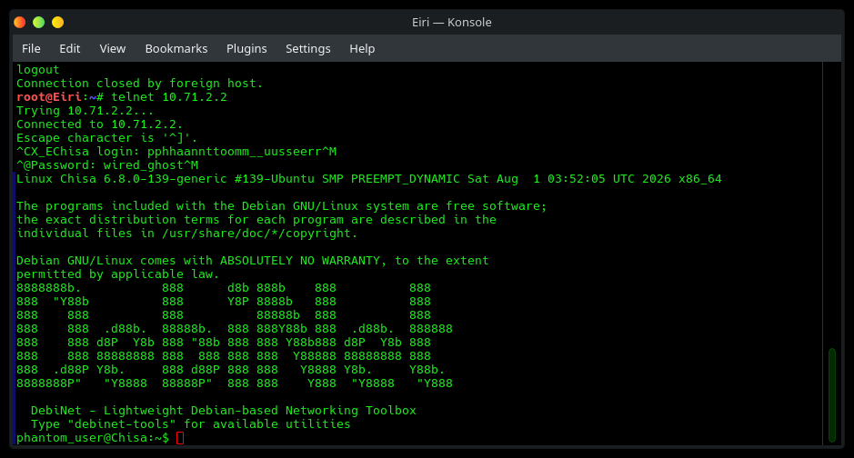

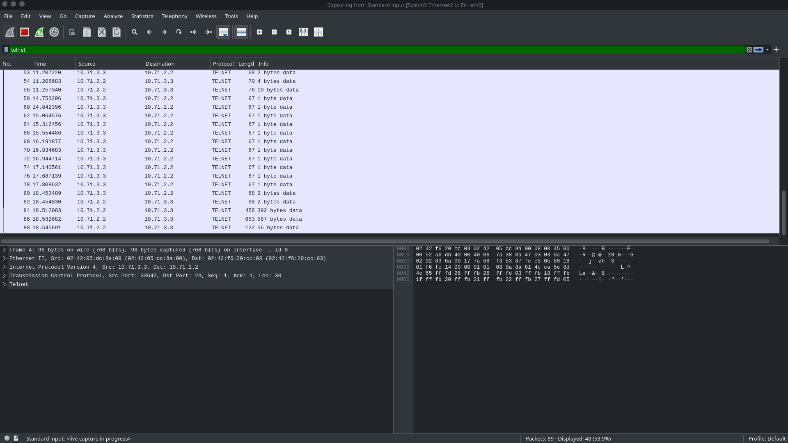

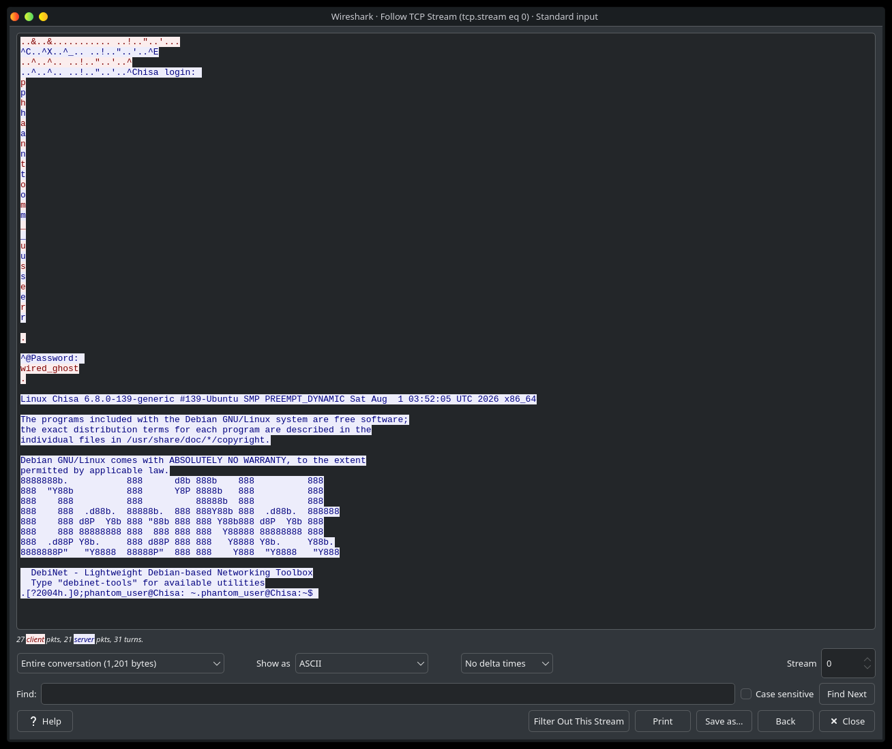

Setiap karakter yang diketik dalam sesi Telnet terkirim dalam paket TCP terpisah karena Telnet beroperasi secara default menggunakan mode `Character-at-a-Time` yang dipadukan dengan mekanisme `Remote Echo`. Dalam mode ini, aplikasi `client` tidak menunggu tombol Enter ditekan untuk mengirimkan data, melainkan langsung membungkus setiap penekanan satu tombol keyboard ke dalam satu segmen TCP dan meneruskannya ke server. Server kemudian memproses karakter tersebut dan mengirimkan balasannya kembali (echo back) ke `client` agar hurufnya baru bisa muncul di layar terminal pengguna. Pendekatan desain interaktif ini awalnya diciptakan untuk mendukung aplikasi terminal berbasis teks seperti editor nano, fitur auto-complete tombol Tab, atau navigasi panah yang membutuhkan respons real-time tanpa jeda baris baru. Akibatnya, pengetikan teks sederhana seperti username atau password akan menghasilkan belasan hingga puluhan paket TCP terpisah, di mana masing-masing paket membawa beban overhead header TCP/IP yang jauh lebih besar dibandingkan payload datanya yang hanya berukuran 1 byte.

## Soal 12

Pertama, buka terminal Knights dan pasang paket OpenSSH dan Nginx/Web Server. Lalu nyalakan layanannya.
```
apt update && apt install -y openssh-server nginx net-tools

service ssh start
service nginx start
```

Verifikasi port 22 dan port 80 sudah listening atau belum.
```
netstat -tuln
```
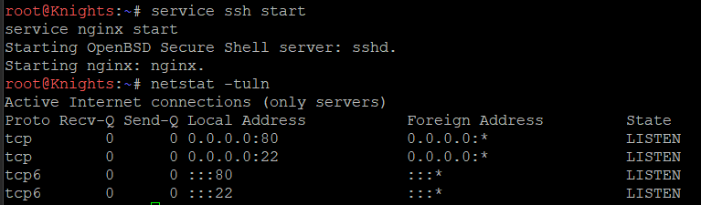

Sekarang, kita buka terminal Alice untuk menyiapkan alat scanner.
```
apt update && apt install -y netcat-openbsd
```

Selanjutnya kita jalankan Wireshark Packet Capture. Sebelum melakukan scan, aktifkan penangkapan paket agar transisi flag terekam. Di GNS3, klik kanan pada link kabel antara Alice (eth0) dan Switch 1.

Pada bilah hijau di atas (display filter), masukkan filter berikut lalu tekan Enter:
```
tcp.port == 22 || tcp.port == 80 || tcp.port == 7777
```

Sekarang, kembali ke terminal Alice dan eksekusi scan menuju Knights.  
Scan Port 22
```
nc -z -v -w 2 10.71.3.2 22
```
Scan Port 80
```
nc -z -v -w 2 10.71.3.2 80
```
Scan Port 7777
```
nc -z -v -w 2 10.71.3.2 7777
```
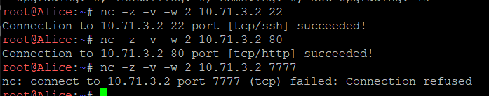

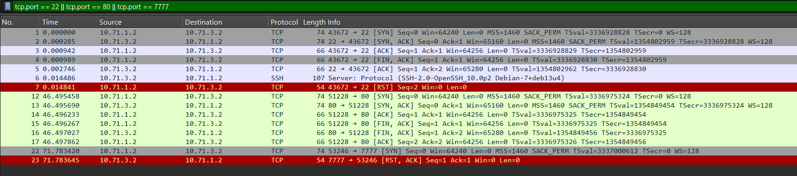

Pada port terbuka, yakni Port 22(SSH) & Port 80(HTTP).  
1. Port 22
- Frame No. 1: Alice (`10.71.1.2`) mengirim paket probe dengan flag `[SYN]` ke Knights (`10.71.3.2:22`).
- Frame No. 2: Knights merespons dengan flag `[SYN, ACK] (Seq=0 Ack=1)`. Ini menandakan layanan SSH aktif mendengarkan (listening) dan menyambut pembentukan koneksi 3-way handshake.
- Frame No. 3: Alice mengirimkan balasan `[ACK]` untuk menyelesaikan handshake, membuktikan status port terbuka / succeeded.

2. Port 80
- Frame No. 12: Alice mengirimkan paket request dengan flag `[SYN]` ke Knights (`10.71.3.2:80`).
- Frame No. 13: Knights merespons dengan flag `[SYN, ACK] (Seq=0 Ack=1)`, membuktikan web server (Nginx/HTTP) aktif dan port 80 berstatus terbuka / succeeded.

3. Port 7777
- Frame No. 22: Alice mengirimkan paket probe dengan flag `[SYN]` ke Knights (`10.71.3.2:7777`).
- Frame No. 23: Knights langsung menolak dengan mengembalikan paket berflag `[RST, ACK] (Seq=1 Ack=1 Win=0)`, sehingga port tersebut sedang tidak aktif listening.

Jika ingin mematikan service di terminal Knights, gunakan:
```
service ssh stop
service nginx stop
```

## Soal 13
Buka terminal Mika, dan buat pengguna `mika_admin`.
```
useradd -m -s /bin/bash mika_admin
su - mika_admin
```

Buat pasangan kunci SSH (tekan Enter kosong agar tidak ada password)
```
ssh-keygen -t rsa -b 2048 -N "" -f ~/.ssh/id_rsa
```

Tampilkan dan saling isi kunci publik yang dibuat.
```
cat ~/.ssh/id_rsa.pub
```
Kemudian, salin seluruh teks yang diawali dengan `ssh-rsa AAAA... mika_admin@Mika`.  
Contohnya:
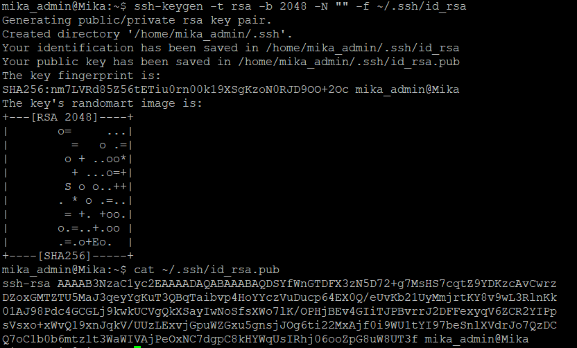

Selanjutnya, buka terminal Knights lalu pasang dan pastikan OpenSSH server aktif:
```
apt update && apt install -y openssh-server
```

Buat pengguna tujuan di Knights dengan user `mika_admin`.
```
useradd -m -s /bin/bash mika_admin
```

Daftarkan kunci publik SSH yang tadi diperoleh ke dalam `authorized_keys` di terminal Knights.
```
mkdir -p /home/mika_admin/.ssh
nano /home/mika_admin/.ssh/authorized_keys
```

Jika sudah, atur permissions agar aman dengan:
```
chmod 700 /home/mika_admin/.ssh
chmod 600 /home/mika_admin/.ssh/authorized_keys
chown -R mika_admin:mika_admin /home/mika_admin/.ssh
```

Kemudian, atur SSH agar menonaktifkan login password.
```
nano /etc/ssh/sshd_config
```

Cari atau tambahkan line berikut di sana, oh iya pastikan tidak ada tanda `#` nya.
```
PubkeyAuthentication yes
PasswordAuthentication no
```
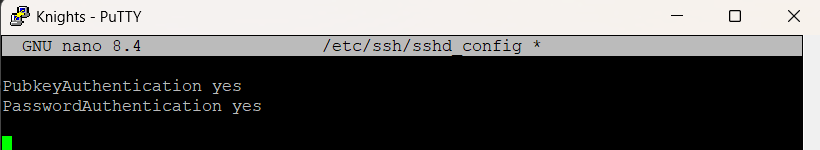

Lalu, restart service SSH di Knights
```
service ssh restart
```

Nah sekarang, mulai capture di Wireshark dengan klik kanan kabel antara Knights dengan Switch3 di GUI GNS3. Dan saat di Wireshark, terapkan display filter:
```
ssh || tcp.port == 22
```

Selanjutnya, kembali ke terminal Mika (sebagai user `mika_admin`), lakukan koneksi SSH ke Knights (`10.71.3.2`). Saat pertama kali muncul konfirmasi fingerprint, ketik `yes`.
```
ssh mika_admin@10.71.3.2
```

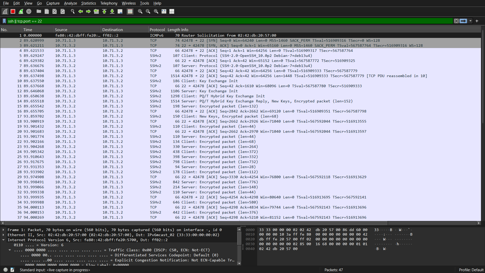
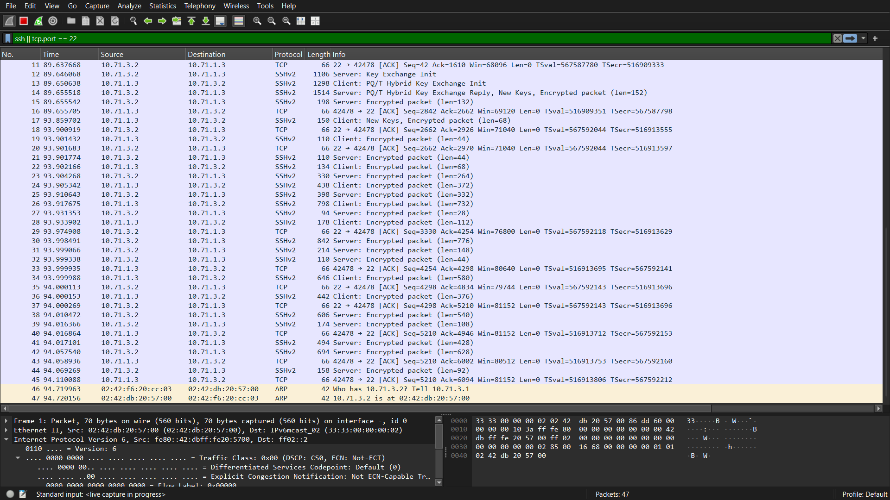

### Identifikasi Paket pada Wireshark.  
1. Inisiasi TCP (3-Way Handshake):  
Frame No. 2, 3, 4: Mika (`10.71.1.3`) dan Knights (`10.71.3.2`) membangun koneksi dasar TCP port 22 menggunakan urutan flag `[SYN]`, `[SYN, ACK]`, dan `[ACK]`.

2. Protocol Version Exchange (Pertukaran Versi Protokol):
- Frame No. 5: `Client: Protocol (SSH-2.0-OpenSSH_10.0p2 Debian-7+deb13u4)`. Di sini Mika mengirimkan string identitas versi SSH yang didukungnya.
- Frame No. 7: `Server: Protocol (SSH-2.0-OpenSSH_10.0p2 Debian-7+deb13u4)`. Di sini Knights membalas dengan versi yang sama, menyepakati penggunaan protokol SSHv2.

3. Key Exchange (KEX):
- Frame No. 10: `Client: Key Exchange Init`. Di sini Mika mengirim daftar cipher, algoritma hash, dan metode KEX yang didukungnya.
- Frame No. 12: `Server: Key Exchange Init`. Di sini Knights memilih kombinasi algoritma yang cocok.
- Frame No. 13: `Client: PQ/T Hybrid Key Exchange Init`. Di sini Mika mengirim nilai ephemeral public key untuk memulai kalkulasi pembentukan shared key.
- Frame No. 14: `Server: PQ/T Hybrid Key Exchange Reply, New Keys, Encrypted packet`. Di sini Knights mengirim respons kalkulasi kunci, bukti verifikasi host key, dan sinyal bahwa server mulai mengaktifkan kunci sesi baru.
- Frame No. 17: `Client: New Keys, Encrypted packet`. Di sini Mika juga mengaktifkan kunci sesi baru. Pada titik ini, seluruh proses negosiasi kunci selesai.

4. Sesi Terenkripsi Penuh (Data & Autentikasi Pengguna):  
Frame No. 19 s.d. 45: Semua paket setelahnya tercatat sebagai `Encrypted packet`.

### Terkait Kredensial Tidak Terlihat.
Kredensial tidak terlihat dalam bentuk teks terbuka seperti pada Telnet, karena:  
1. Autentikasi Terjadi di Dalam Saluran Terenkripsi:  
Pada protokol Telnet, proses login dilakukan sebelum ada keamanan apa pun. Telnet tidak memiliki fitur kriptografi, sehingga username dan password dikirim sebagai teks ASCII murni (_plaintext_) yang bisa langsung dibaca oleh sniffer.  
Pada protokol SSH, tahap autentikasi pengguna baru dilakukan setelah paket `New Keys` disepakati (mulai Frame No. 17 ke atas). Artinya, identitas dan proses pembuktian akun sudah dibungkus rapat di dalam symmetric cipher (seperti ChaCha20/Poly1305 atau AES-GCM). Di Wireshark, isinya murni berupa ciphertext acak.

2. Kunci Privat Tidak Pernah Dikirim ke Jaringan (Public Key Authentication):  
Karena menggunakan autentikasi kunci publik (`ssh-keygen`), node Mika sama sekali tidak pernah mengirimkan private key ataupun kata sandi ke Knights.  
Yang terjadi adalah, server Knights mengirim sebuah tantangan acak (challenge), lalu Mika menandatangani tantangan tersebut menggunakan private key miliknya secara lokal di komputernya. Server Knights kemudian cukup memverifikasi tanda tangan tersebut menggunakan public key yang terdaftar di `~/.ssh/authorized_keys`.

3. Penyusup Hanya Melihat Ciphertext:  
Siapa pun (termasuk Wireshark) yang menangkap paket dari kabel tidak memiliki _shared session key_ hasil perhitungan algoritma Diffie-Hellman/Post-Quantum Hybrid tersebut, sehingga pesan tidak dapat didekripsi.

## Soal 14
Soal kali ini kita diminta untuk menganalisis file yang diberikan menggunakan `wireshark` untuk menemukan informasi serangan `brute-force` lalu memasukkan jawabannya ke server kuis atau socket lewat `netcat`.

### Download File
Langkah awal pengerjaan soal ini adalah mendownload dulu file `wired_bruteforce.pcapng` yang diberikan pada soal. Setelah selesai download, buka filenya lewat `wireshark`.

### Cari Informasi Penting
Langkah kedua disini kita mencari informasi penting yang ada di file yang kita download tadi.

1. IP Penyerang, Target IP, dan Target Port

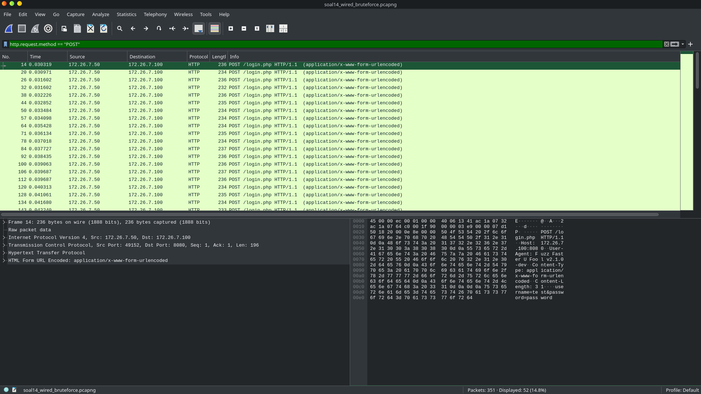

Ketik `http.request.method == "POST"` pada kolom filter. Lihat pada kolom `source`, itu adalah IP Penyerang, kolom `destination` adalah Target IP, dan lihat pada bagian Transmission Control Protocol disitu terdapat Target Port.

2. Password Berhasil Ditembus

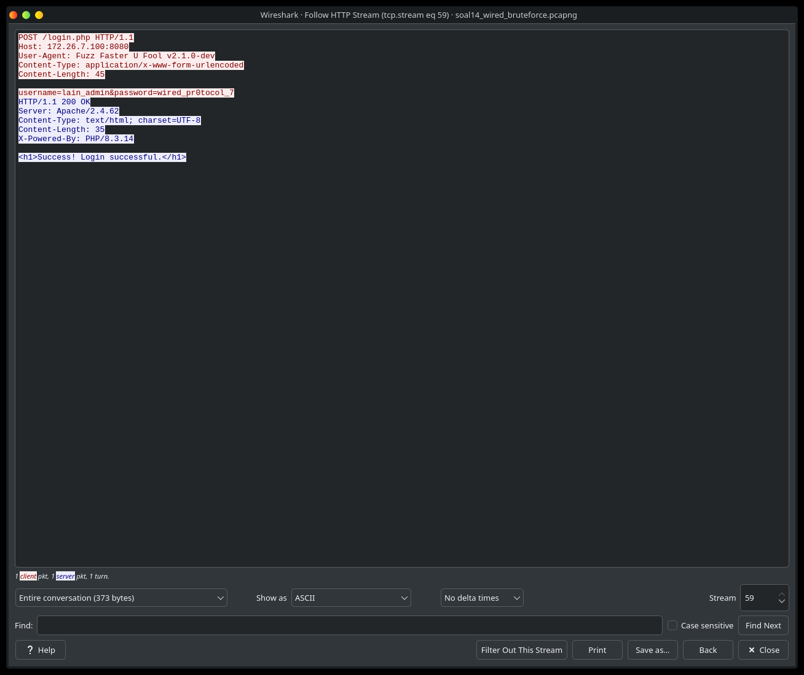

Ketik `http.response.code == 200 || http.response.code == 302` pada kolom filter. Klik kanan pada paket respon sukses yang muncul, lalu klik follow, klik `HTTP Stream`, setelah itu akan muncul jendela teks lalu scroll ke bagian request POST (teks merah). Cari baris yang berisi username=lain_admin untuk melihat nilai password yang dikirimkan.

3. Web Server Software dan Version

Di jendela yang `HTTP Stream` yang sama lihat bagian respon server (teks biru), cari header server (Apache/2.4.62).

4. Validasi ke Socket Server

Jalankan
```
nc [IP_Group] 3401
```
Disini kita akan gunakan `nc 192.168.122.1 3041`, disini saya memakai `IP Gateway NAT1`

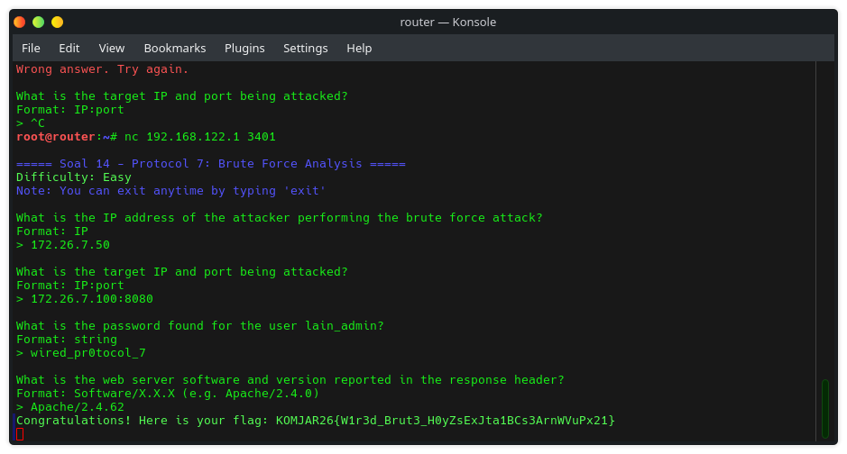

## Soal 15
Di soal kali ini kita diminta menganalisis aktivitas USB dan memvalidasi hasilnya ke socket server di port 3401.

### Download File
Download file yang sudah diberikan lalu buka dengan `wireshark`.

### Mencari Vendor ID, Product ID, dan Device Address
Ketik di kolom filter `usb.idVendor || usb.idProduct`. Klik paketnya lalu ekspansi detail paketnya (USB URB dan Device Descriptor).

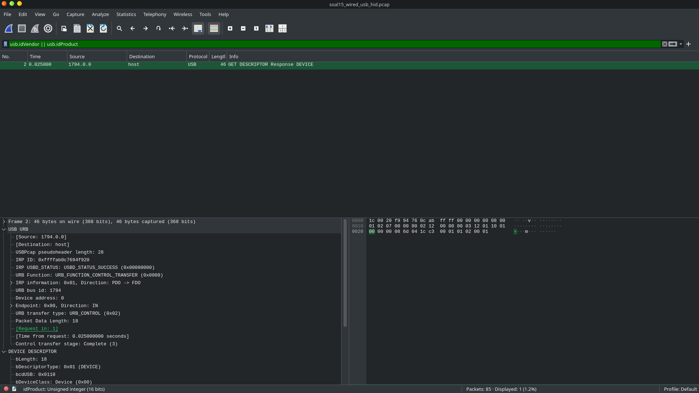

### Ekstrak dan Transkrip Keystroke
Ketik di kolom filter `usb.capdata || usbhid.data`.

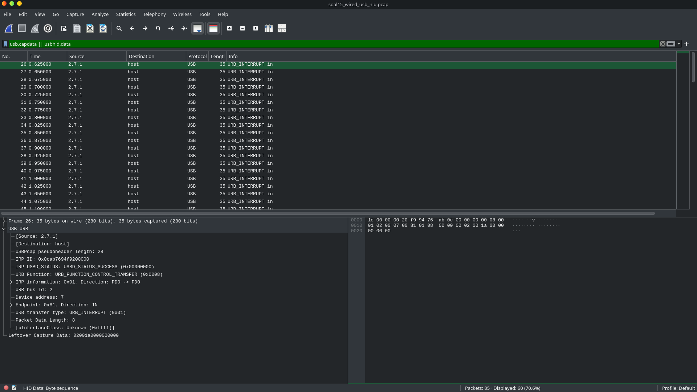

agar kita tidak perlu membaca ratusan baris hex secara manual, kita bisa mengekspor nilai hex tersebut. Klik menu File di pojok kiri atas $\rightarrow$ Export Packet Dissections $\rightarrow$ As Plain Text atau jika mau pakai terminal bisa jalankan
```
tshark -r soal15_wired_usb_hid.pcap -Y "usb.capdata" -T fields -e usb.capdata > hex.txt
```
setelah itu ubah kumpulan data hex tersebut menjadi teks karakter keyboard dengan script Python USB HID Keycode Decoder untuk membaca pesan rahasianya.

### Validasi Pada Socket Server
Disini saya memakai `nc 192.168.122.1 3402`.

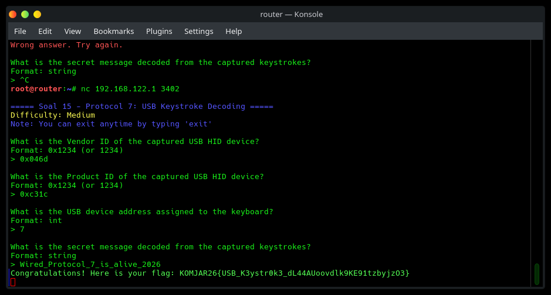

## Soal 16
Soal kali ini kita diminta untuk menganalisis lalu lintas FTP untuk menemukan 4 informasi utama lalu memvalidasinya ke socket server di port 3403.

### Download File
Download file yang sudah diberikan setelah itu buka di `wireshark`.

### Filter dan Follow TCP Streams
Ketik di kolom filter `ftp`, klik kanan pada paket mana saja yang muncul, klik follow lalu TCP Stream. Akan muncul jendela pop-up baru berisi teks percakapan FTP warna Merah (perintah client/penyerang) dan Biru (balasan server).

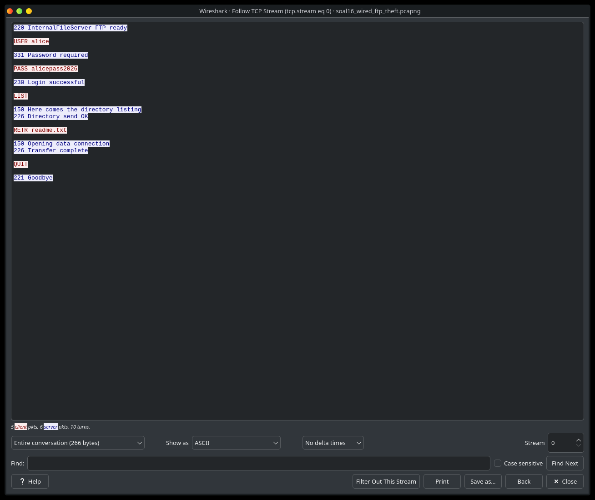

ketik `ftp.request.command == "RETR"`. Klik kanan pada paket hasil filter yang mengunduh `knights_payload.exe`. Klik follow lalu TCP Stream. Di jendela Stream yang baru itu, kamu akan melihat banner, username, password, dan ukuran byte file malware-nya.

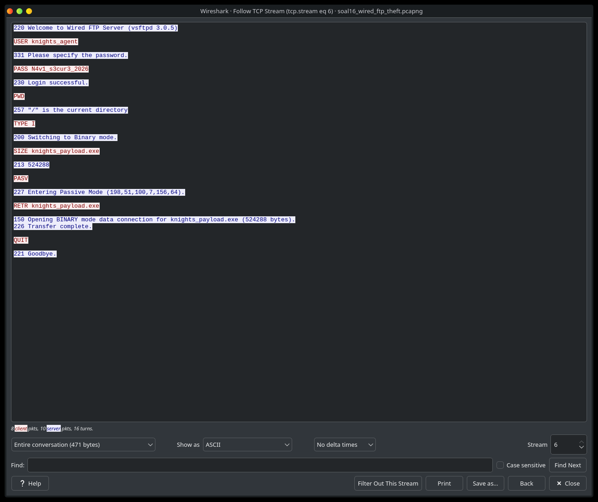

### Validasi ke Socket Server
Buka terminal router dan konek ke socket server port 3403, validasi seperti tadi `nc 192.168.122.1 3403`.

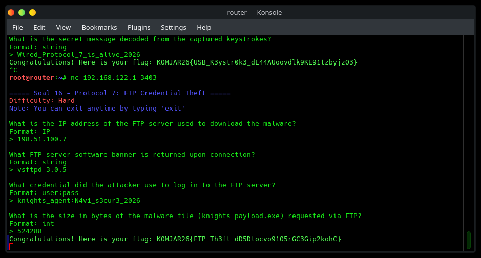

## Soal 17
Soal kali ini diminta menganalisis file untuk menemukan 4 informasi utama lalu memvalidasinya ke socket server di port 3404.

### Download File
Download filenya lalu buka di `wireshark`.

### Filter
Di kolom filter ketik `http.request || http.response`.

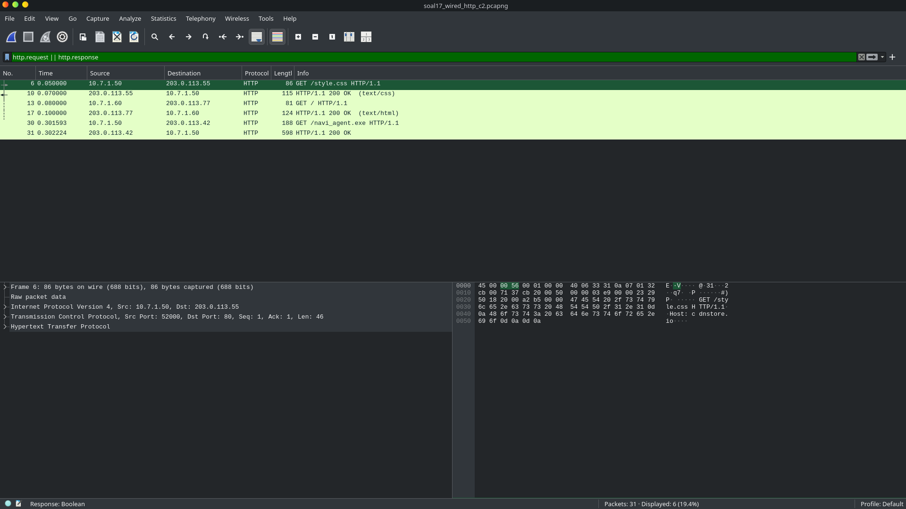

### Cari Request Unduhan File Executable
Cari paket dengan metode GET yang meminta file dengan ekstensi .exe. Klik kanan paket tersebut $\rightarrow$ Follow $\rightarrow$ HTTP Stream.

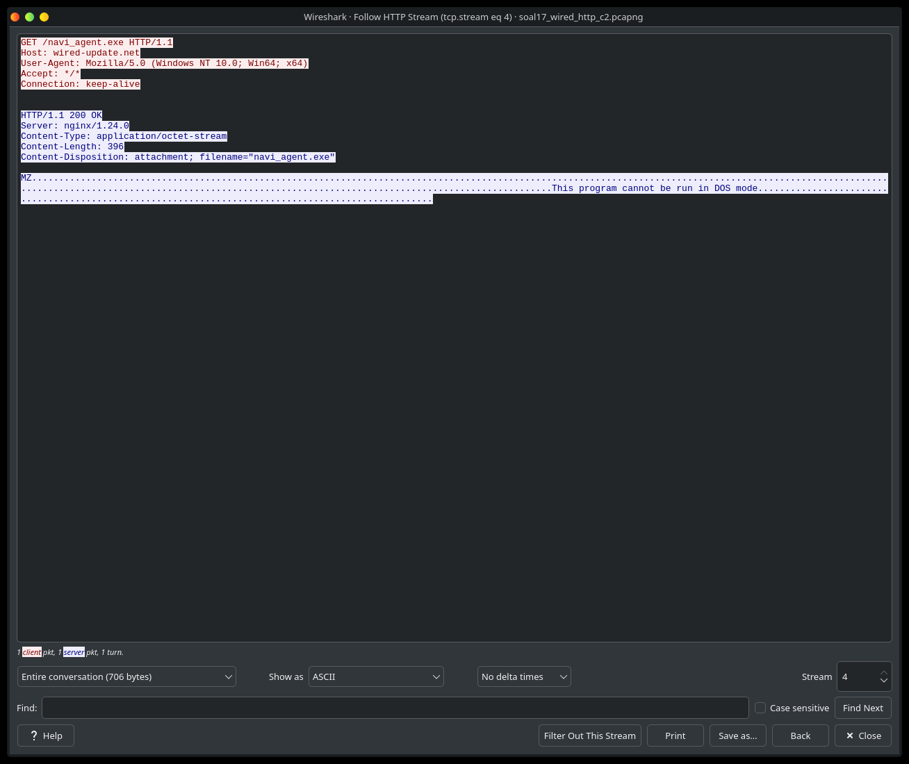

### Validasi
Buka terminal router dan konek ke socket server port 3404, jalankan `nc 192.168.122.1 3404`.

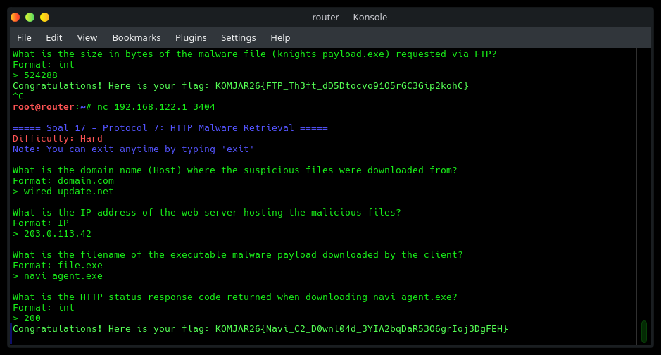

## Soal 18
Pada soal ini kita diminta untuk melacak aktivitas transfer malware yang dilakukan melalui protokol SMB.

### Download File
Download filenya lalu buka di `Wireshark`.

### Protokol Jaringan yang di Eksploitasi
Untuk mencarinya, terapkan filter berikut pada display filter:
```
smb
```
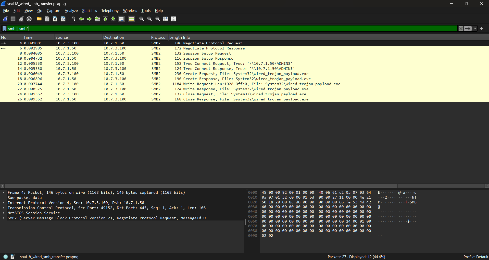

### IP Pengirim & IP Penerima
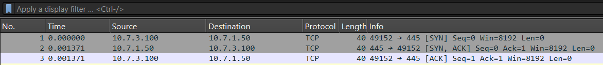
- IP Pengirim  
Berdasarkan gambar, terlihat bahwa IP Pengirim (Eiri) adalah `10.7.3.100`.
- IP Penerima  
Berdasarkan gambar, terlihat bahwa IP Penerima adalah `10.7.1.50`.

### Folder Tujuan
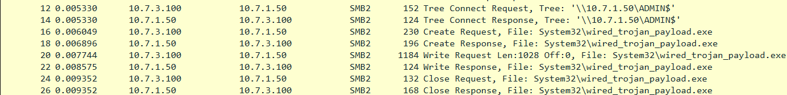
Terlihat bahwa folder tujuan penyimpanannya adalah `System32`. Path tree lengkapnya adalah `\\10.7.1.50\ADMIN$`.

### Nama File Malware
Nama file malware yang saya temukan adalah pada direktori `System32` dengan nama `wired_trojan_payload.exe`.

### Validasi ke Socket Server
Buka terminal router dan connect ke socket server port 3405, jalankan `nc 192.168.122.1 3405`.
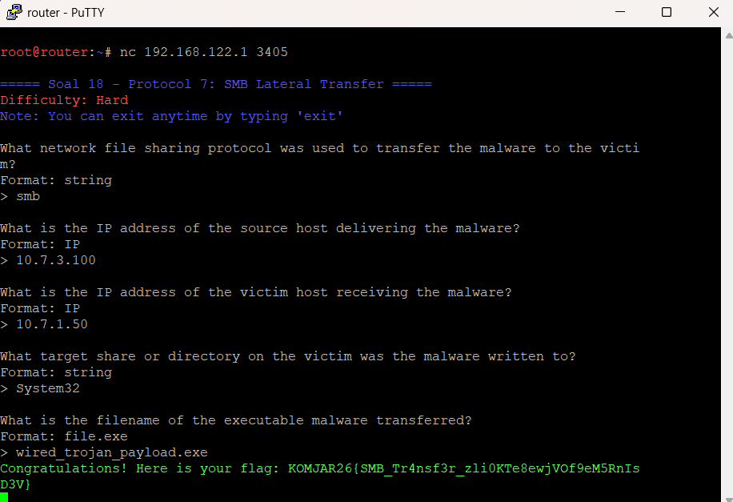

## Soal 19
Pada soal ini kita diminta untuk identifikasi alamat email korban yang ditargetkan, password korban yang diklaim bocor oleh penyerang, jenis malware yang diinfeksikan, batas waktu (dalam hari) yang diberikan, serta MailClientID yang tercantum pada pesan.

Langkah pertama adalah menerapkan `smtp` pada display filter.
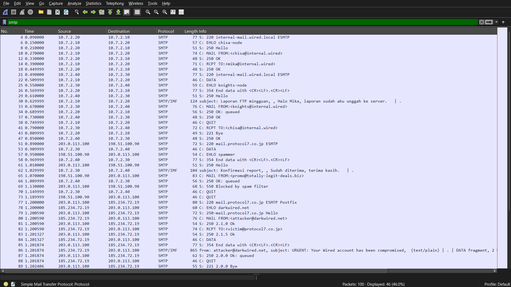

Di sini, kita cari baris komunikasi pada SMTP tersebut yang berisikan perintah `DATA`. Setelah itu, klik kanan pada protokol SMTP `DATA` tersebut dan pilih Follow > TCP Stream.

Pada baris ke 84, yang berisikan perintah `DATA`, isinya adalah:
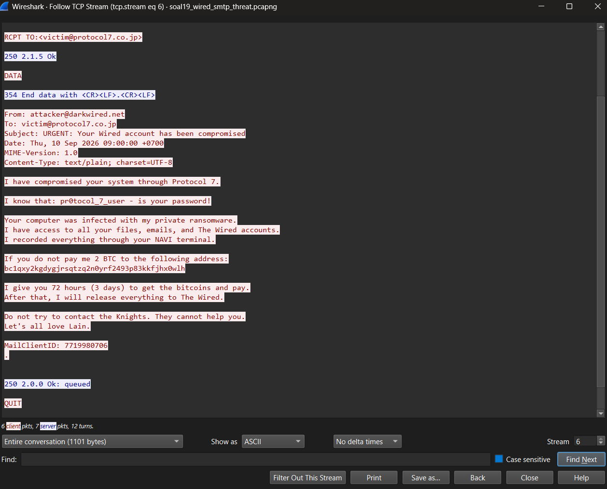

Di sini terindentifikasi bahwa:
1. Alamat Email Korban: `victim@protocol7.co.jp`
2. Password Korban: `pr0tocol_7_user`
3. Jenis Malware: `ransomware`
4. Batas Waktu (dalam hari): `3`
5. MailClientID: `7719980706`

### Validasi ke Socket Server
Buka terminal router dan connect ke socket server port 3406, jalankan `nc 192.168.122.1 3406`.
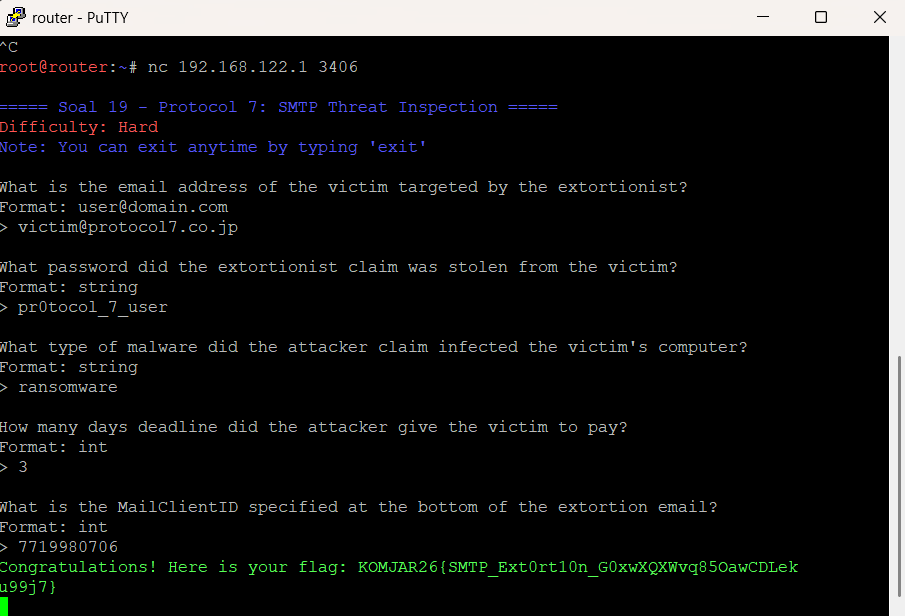

## Soal 20
Pada soal terakhir ini, kita diminta untuk menganalisis file capture `wired_tls_decrypt.pcapng` bersama `keyslogfile.txt` untuk mengidentifikasi versi protokol TLS yang dinegosiasikan, nama domain (SNI) yang diakses, alamat IP server HTTPS penyerang, User-Agent yang digunakan, serta HTTP request method dan path yang tersembunyi di dalam sesi dekripsi.

Pertama buka file `wired_tls_decrypt.pcapng` dengan Wireshark.  
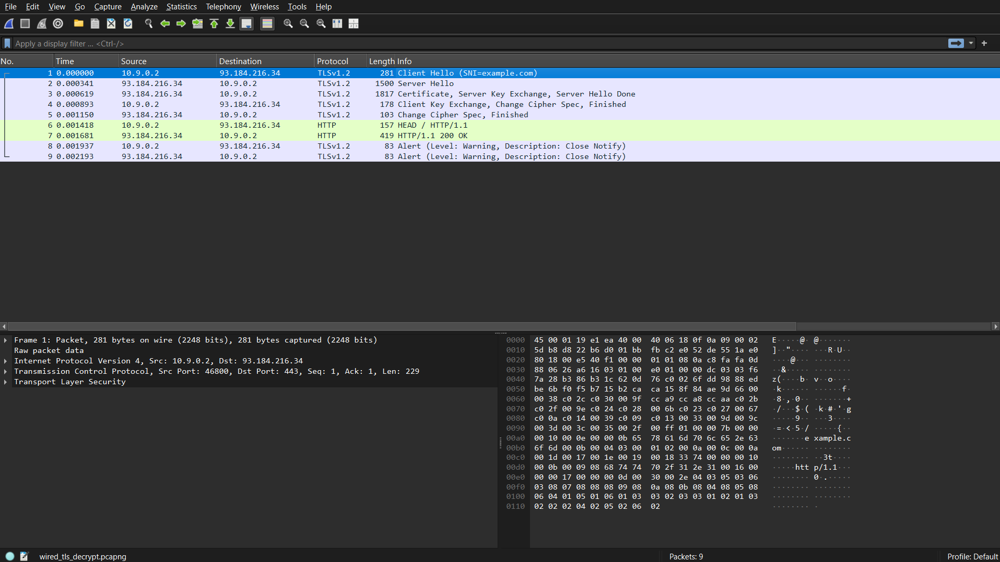

Selanjutnya, buka Edit > Preferences, lalu buka dropdown Protocols, scroll sampai ketemu dan klik TLS, pada bagian (Pre)-Master-Secret log filename klik Browse dan pilih file `keyslogfile.txt`.  
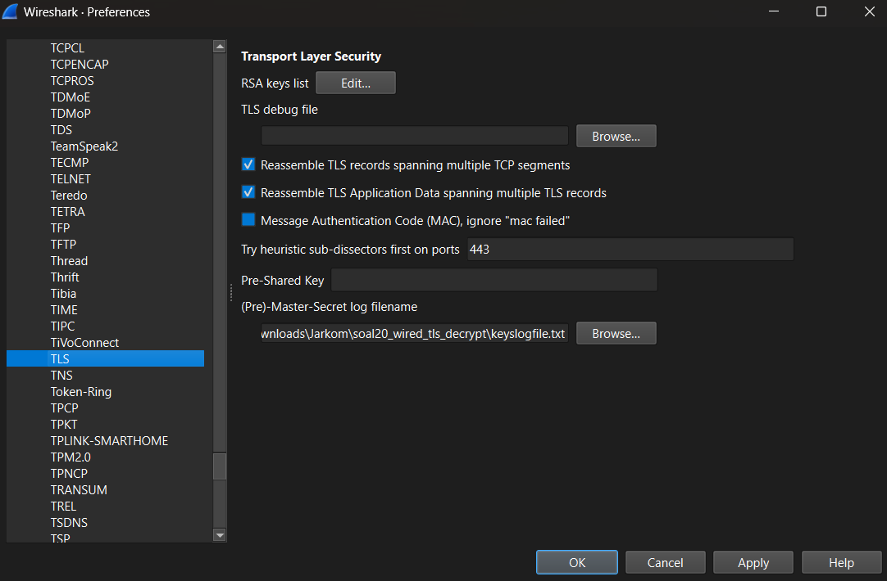
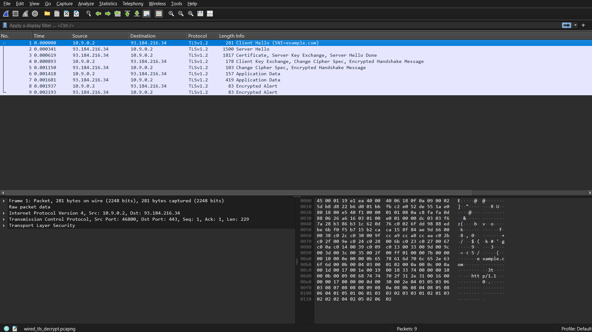

### Versi Protokol TLS & SNI & Alamat IP Server HTTPS Penyerang
Sekarang kita akan mencari parameter yang diminta soal.  
Ketik filter `tls.handshake.type == 1` pada display filter (Client Hello).  
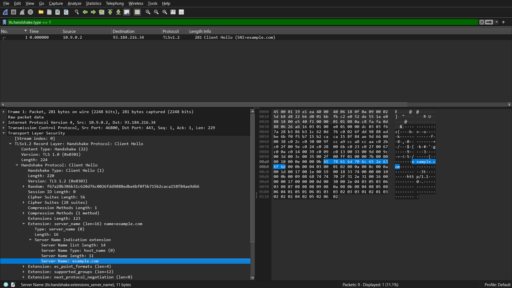

Ketik filter `tls.handshake.type == 2` pada display filter (Server Hello).  
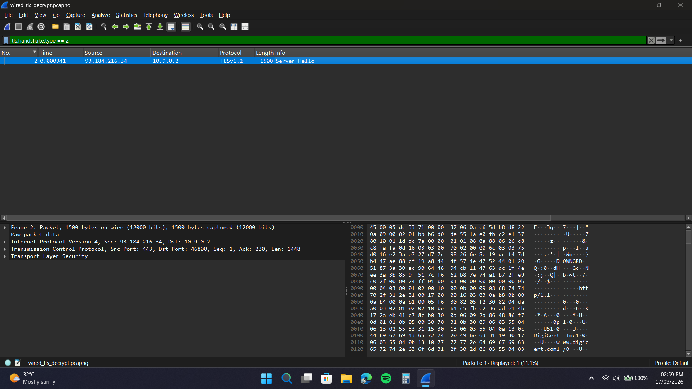

Berdasarkan gambar, terlihat bahwa:  
- Versi Protokol TLS: `TLSv1.2`
- Nama Domain (SNI): `example.com`
- IP Server HTTPS Penyerang: `93.184.216.34`

IP `10.9.0.2` adalah alamat mesin korban yang terinfeksi dan sedang mengeksekusi malware (bertindak sebagai klien HTTP), sedangkan 93.184.216.34 adalah server web/HTTPS.

### User Agent & HTTP Request Method & Path
Ketik filter menjadi `http` pada display filter.
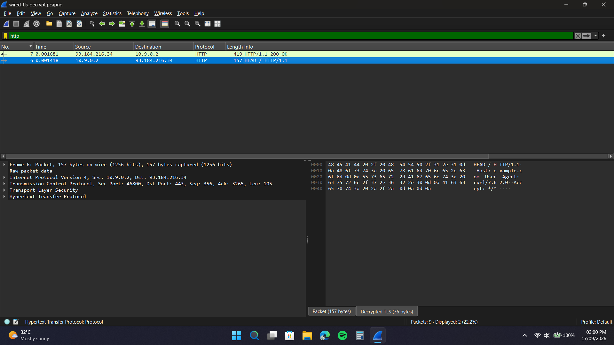

Berdasarkan gambar, terlihat bahwa:
- User-Agent: `curl/7.62.0`
- HTTP request method: `HEAD`
- HTTP request path: `/`

### Validasi ke Socket Server
Buka terminal router dan connect ke socket server port 3407, jalankan `nc 192.168.122.1 3407`.  
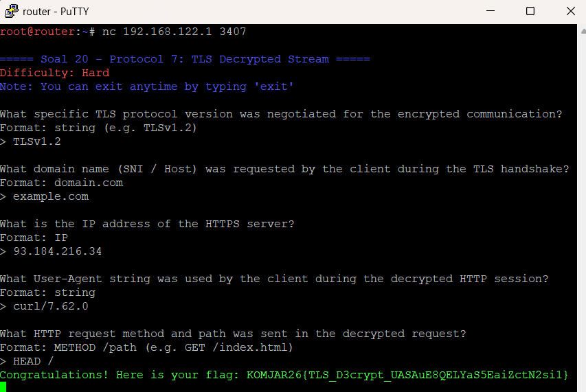