# Jarkom-Modul-1-2026-K-15


| Nama | NRP |
| ---  | --- |
| I Made Tobby Anantha Adiwijaya | 5027251064 |
| Rheza Pramudita Adi Putra | 5027251090 |


## Soal 1

Pertama disini kita harus membuat Node yang diperlukan, disini kita memakai 1 Nat, 3 Switch, dan 5 Debinet (Client).

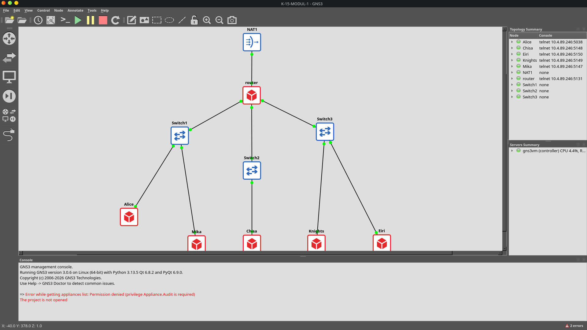

Sambungkan Nodenya sesuai tugas yang diberikan. Kita juga harus melakukan configurasi pada client agar bisa terhubung ke jaringan.

Client 1:
```
auto eth0
iface eth0 inet static
address 10.71.1.2
netmask 255.255.255.0
gateway 10.71.1.1
up echo "nameserver 8.8.8.8" > /etc/resolv.conf
```

Client 2:
```
auto eth0
iface eth0 inet static
address 10.71.1.3
netmask 255.255.255.0
gateway 10.71.1.1
up echo "nameserver 8.8.8.8" > /etc/resolv.conf
```

Client 3:
```
auto eth0
iface eth0 inet static
address 10.71.2.2
netmask 255.255.255.0
gateway 10.71.2.1
up echo "nameserver 8.8.8.8" > /etc/resolv.conf
```

Client 4:
```
auto eth0
iface eth0 inet static
address 10.71.3.2
netmask 255.255.255.0
gateway 10.71.3.1
up echo "nameserver 8.8.8.8" > /etc/resolv.conf
```

Client 5:
```
auto eth0
iface eth0 inet static
address 10.71.3.3
netmask 255.255.255.0
gateway 10.71.3.1
up echo "nameserver 8.8.8.8" > /etc/resolv.conf
```

## Soal 2
Disini kita perlu melakukan konfigurasi agar Router bisa menggunakan internet.

auto eth0
iface eth0 inet dhcp
up sysctl -w net.ipv4.ip_forward=1    
up iptables -t nat -A POSTROUTING -o eth0 -j MASQUERADE   

auto eth1
iface eth1 inet static
address 10.71.1.1
netmask 255.255.255.0

auto eth2
iface eth2 inet static
address 10.71.2.1
netmask 255.255.255.0

auto eth3
iface eth3 inet static
address 10.71.3.1
netmask 255.255.255.0


## Soal 3
Disini kita melakukan pengujian memastikan client satu sama lain terhubung.


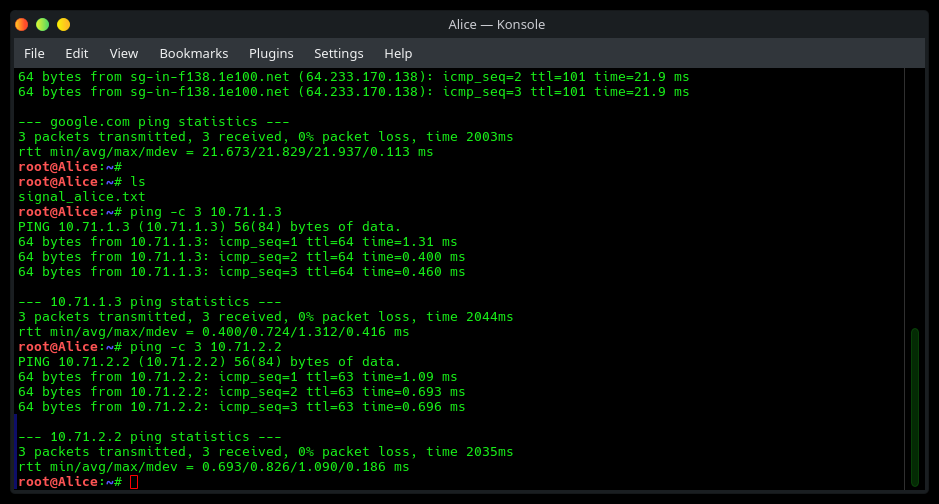

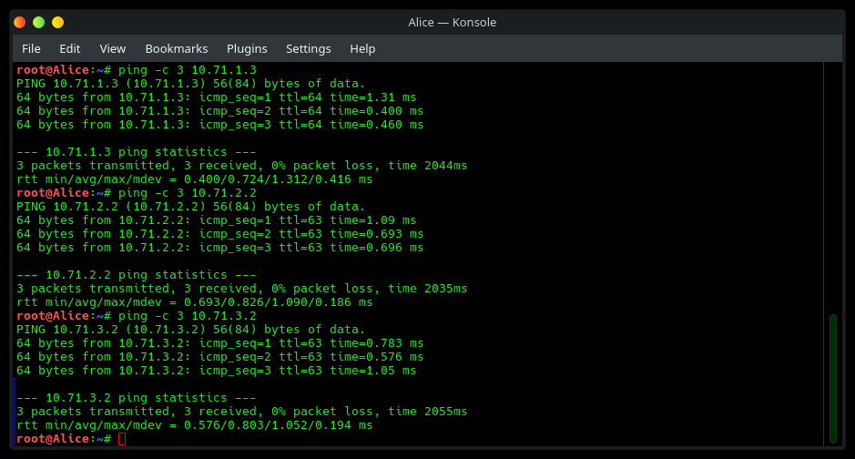

Disini kami hanya mencontohkan 3 saja.

## Soal 4
Disini kita melakukan pengecekan apakah client bisa melakukan `ping -c 3 8.8.8.8` dan `ping -c 3 google.com`.


## Soal 5
Untuk mengantisipasi restart yang tiba-tiba, disini kita membuat script agar konfigurasi jaringan tidak hilang.


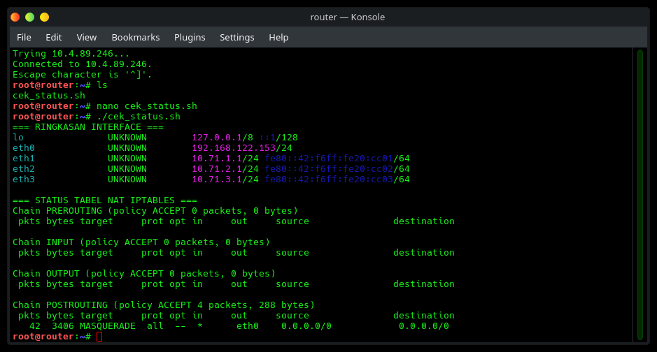

## Soal 6
Disini kita melakukan penyaringan pada paket berprotokol DNS atau ICMP. Disini kita bisa mendownload filenya menggunakan wget / gdown. Setelah file berhasil didownload kita harus unzip filenya. Buka GNS3 lalu capture bagian interface node Mika. Setelah itu jalankan file traffic_protocol7.sh lalu buka wireshark. Lakukan filter untuk menyaring paket yang berprotokol DNS atau ICMP.


Berdasarkan tangkapan layar Wireshark yang ditampilkan, seluruh lalu lintas data paket dari node `10.71.1.3` terpantau berjalan lancar dan lolos tanpa hambatan. Pada protokol ICMP, permintaan ping yang dikirimkan ke DNS server publik `8.8.8.8` (No. 1) dan `1.1.1.1` (No. 2) berhasil mendapatkan balasan *echo reply* secara lengkap pada paket No. 8 dan No. 9. Sementara itu pada protokol DNS, berbagai permintaan resolusi domain IPv4 (A) maupun IPv6 (AAAA) juga berhasil menerima balasan dari server tujuan, seperti domain `its.ac.id` yang terresolusi ke IP `103.94.189.5` (No. 10 & 18), `github.com` ke IP `20.205.243.166` (No. 14), `example.com` ke IP `92.68.147.243` dan `104.28.23.154` (No. 16), cluster IP `google.com` (No. 17), serta alamat IPv6 untuk `cloudflare.com` (No. 13).

## Soal 7
Pada soal ini kita jadikan node Chisa sebagai FTP server.

Pertama pasang vsftpd dan buat direktori shared di terminal Chisa.
```
apt-get update && apt-get install -y vsftpd
mkdir -p /var/wired/data
chmod 777 /var/wired/data
```

Selanjutnya, buat ketiga akun Linux di terminal Chisa dengan home directory mengarah ke /var/wired/data.
```
useradd -d /var/wired/data -s /bin/bash alice
echo "alice:password" | chpasswd

useradd -d /var/wired/data -s /bin/bash mika
echo "mika:password" | chpasswd

useradd -d /var/wired/data -s /bin/bash eiri
echo "eiri:password" | chpasswd
```
Berarti di sini ketiga akun tersebut passwordnya adalah `password`

Untuk mengecek jika sudah terbuat atau belum, gunakan:
```
cat /etc/passwd | grep -E "alice|mika|eiri"
```

Buka file konfigurasi vsftpd:
```
nano /etc/vsftpd.conf
```

Tambahkan baris-baris berikut di dalamnya:
```
listen=YES
listen_ipv6=NO
anonymous_enable=NO
local_enable=YES
write_enable=YES

# Mengarahkan user lokal ke folder data
local_root=/var/wired/data

# Blacklist Eiri
userlist_enable=YES
userlist_file=/etc/vsftpd.user_list
userlist_deny=YES

# Konfigurasi per-user (untuk membedakan Alice dan Mika)
user_config_dir=/etc/vsftpd_user_conf
```

Kemudian buat blacklist Eiri di terminal Chisa
```
echo "eiri" > /etc/vsftpd.user_list
```

Lalu, batasi akses Mika (Read-Only)
```
mkdir -p /etc/vsftpd_user_conf
echo "write_enable=NO" > /etc/vsftpd_user_conf/mika
echo "write_enable=YES" > /etc/vsftpd_user_conf/alice
```

Sekaran kita uji, pada terminal Alice, Mika, dan Eiri jangan lupa install ftp.
```
apt update && apt install ftp -y
```
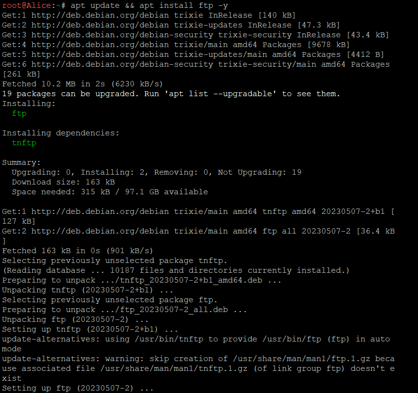

Kita coba buat terminal Alice dengan:
```
echo "Ini sinyal rahasia dari Alice" > signal_alice.txt
ftp -n 10.71.2.2 <<EOF
user alice password
put signal_alice.txt
ls
quit
EOF
```
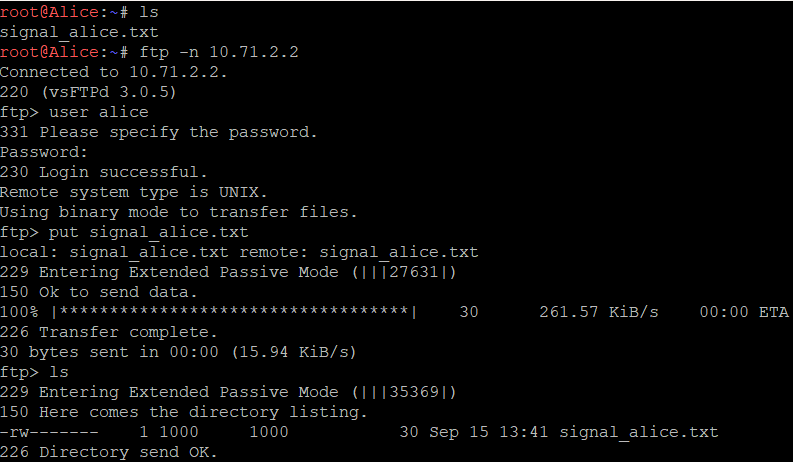


Kita coba buat terminal Mika dengan:
```
echo "halo" > test_mika.txt
ftp -n 10.71.2.2 <<EOF
user alice password
put test_mika.txt
ls
quit
EOF
```
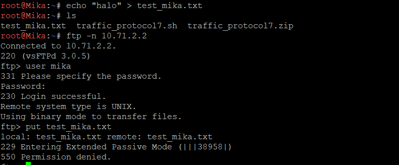


Kita coba buat terminal Eiri dengan:
```
ftp -n 10.71.2.2 <<EOF
user eiri password
quit
EOF
```
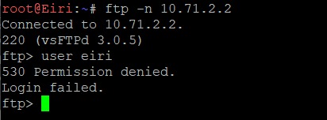

## Soal 8
Download file yang dibutuhkan:
```
apt update && apt install -y wget

wget --no-check-certificate 'https://docs.google.com/uc?export=download&id=1lFepK4wFmx55PnRki3NsHW-ivudSR0vg' -O knights_report.zip
```

Unzip file nya:
```
unzip knights_report.zip
```

Sekarang, nyalakan sniffing di wireshark dengan klik kanan pada kabel ntara Knights (`eth0`) dan Switch 3. Pilih Start capture lalu klik OK. Di jendela Wireshark yang terbuka, masukkan filter di bilah atas:
```
ftp || ftp-data
```

Buka terminal Knights, lalu ketik dan masukkan user `alice` dan password `password`:
```
ftp -p 10.71.2.2
```

Setelah masuk ke prompt `ftp>`, jalankan:
```
put knights_report.txt
bye
```
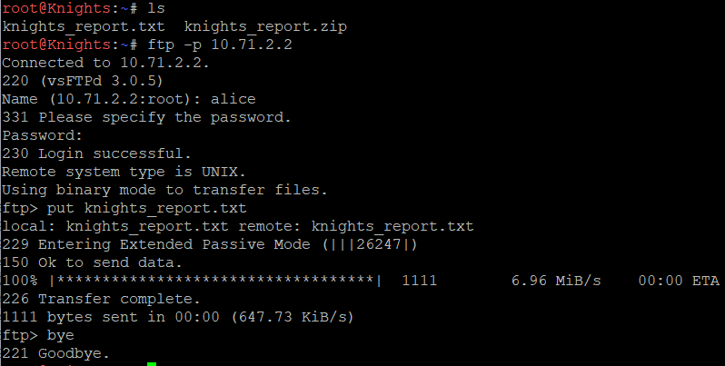

Hasil capture berikut:
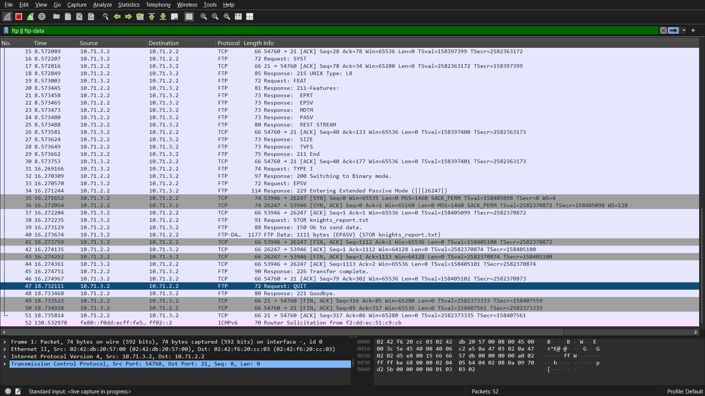

Terlihat bahwa perintah FTP untuk Upload (STOR):
`Paket No. 38 (dari 10.71.3.2 ke 10.71.2.2):`
```
Request: STOR knights_report.txt
```
Perintah yang dikirimkan client ke server saat mengunggah file adalah `STOR knights_report.txt.`

---
Kemudian, untuk kode Status Sukses Server (226):
`Paket No. 45 (dari 10.71.2.2 ke 10.71.3.2):`
```
Response: 226 Transfer complete.
```
Server merespons dengan kode `226 (Transfer complete)`, yang menandakan berkas telah diterima dan disimpan secara utuh.

---
Selanjutnya, Port Data TCP yang Dinegosiasikan pada Mode PASV / EPSV:
`Paket No. 34 (Respons server terhadap request EPSV pada No. 33):`
```
Response: 229 Entering Extended Passive Mode (|||26247|)
```

Port Data TCP yang dinegosiasikan adalah `26247`. Hal ini terbukti langsung pada paket No. 35, 36, 37, dan 40 (FTP-DATA), di mana koneksi transfer data dibuka menggunakan port tujuan `26247` (`53946` → `26247`).

## Soal 9
Jalankan service vsftpd di terminal Chisa dengan `service vsftpd start` dan pastikan statusnya running `service vsftpd status`. Buat folder penyimpanan utama `mkdir -p /var/wired/data`, buat user alice, mika, dan eiri
```
useradd -m -d /var/wired/data alice
useradd -m -d /var/wired/data mika
useradd -m -d /var/wired/data eiri
```
lalu atur permission direktori
```
chown root:root /var/wired/data
chmod 777 /var/wired/data
```
buat file userlist blacklist untuk eiri
```
echo "eiri" > /etc/vsftpd.userlist
chmod 644 /etc/vsftpd.userlist
```
tambahkan konfigurasi ke paling bawah /etc/vsftpd.conf
```
cat <<EOT >> /etc/vsftpd.conf
listen=YES
listen_ipv6=NO
anonymous_enable=NO
local_enable=YES
write_enable=YES
userlist_enable=YES
userlist_file=/etc/vsftpd.userlist
userlist_deny=YES
user_config_dir=/etc/vsftpd_user_conf
EOT
```
set aturan Read-Only khusus user Mika
```
mkdir -p /etc/vsftpd_user_conf
echo "write_enable=NO" > /etc/vsftpd_user_conf/mika
```
restart service vsftpd dengan `service vsftpd restart`, lalu masuk ke terminal Mika jalankan `ftp 10.71.2.2`. Input username `mika` dan password `123`, setelah login sukses maka jalankan `put file_baru_mika.txt`, Server akan memberikan respon 550 Permission denied, yang membuktikan pembatasan read-only untuk Mika berhasil 100%.

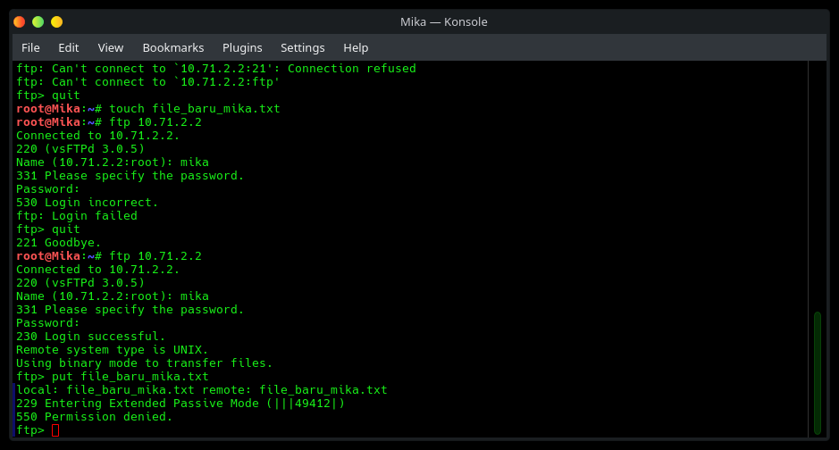

## Soal 10
Disini diminta untuk menguji latensi dan stabilitas jaringan antara node Knights dan FTP Server Chisa menggunakan perintah ping khusus, lalu menganalisis hasilnya di terminal dan Wireshark. Langkah pertamanya start capture pada node `Knights`, lalu kirimkan paket ping dari node Knights ke node Chisa dengan payload khusus 128 bytes dan interval 0.3 detik sebanyak 77 paket `ping -c 77 -s 128 -i 0.3 10.71.2.2`.

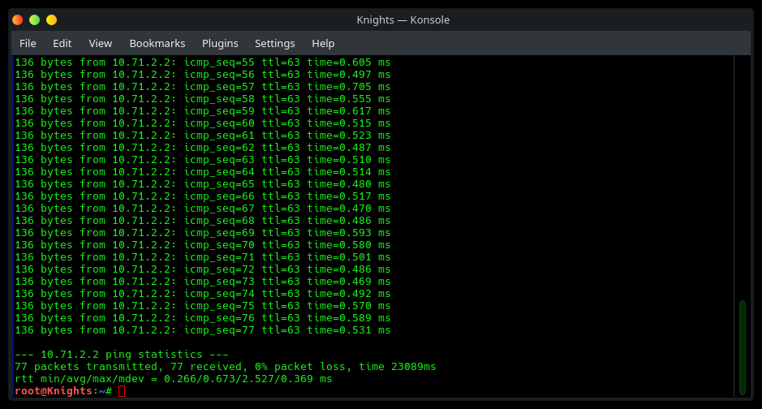

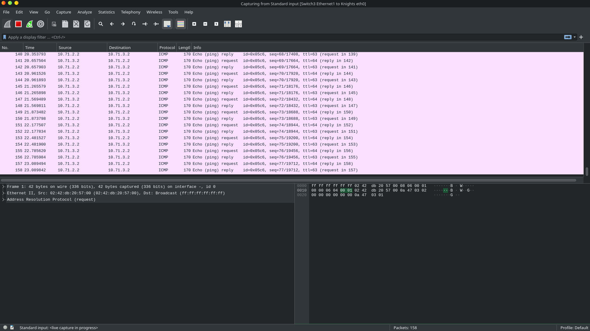

berdasarkan data pcap, `Echo Request` (Type 8 Code 0) dan `Echo Reply` (Type 0 Code 0). `Packet Loss` 0% yang artinya seluruh request direspon secara lengkap. Untuk mendapatkan ringkasan RTT bisa dilihat pada bagian paling bawah terminal.
